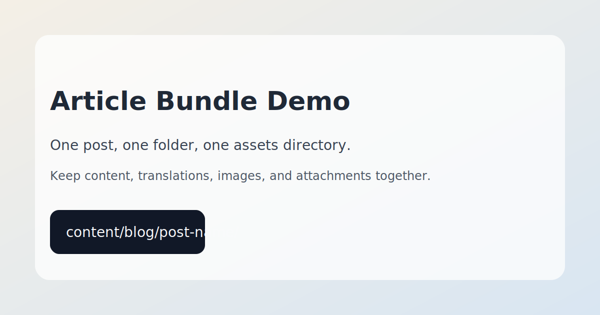
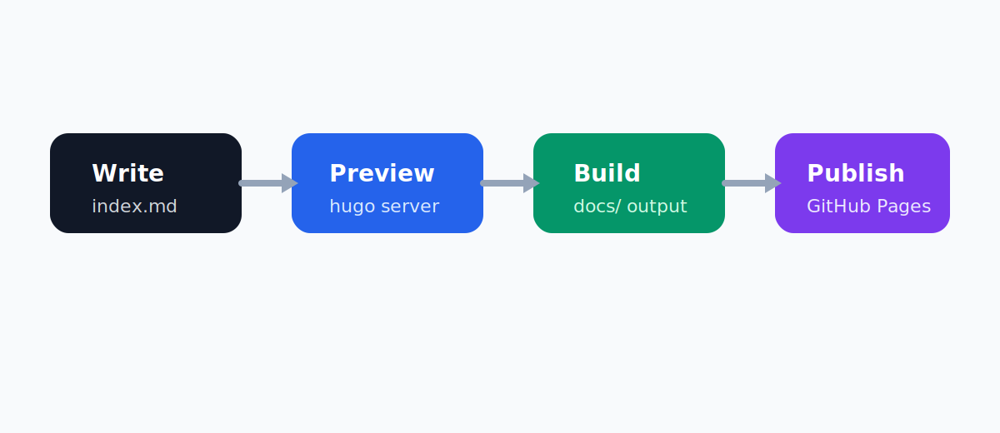

这篇文章不是为了写内容本身，而是为了**展示一篇文章在仓库里应该如何组织**，让目录看起来更像工程，而不是一堆散落文件。

## 推荐目录结构

这篇文章自己的目录建议长这样：

```text
content/blog/folder-structure-demo/
  index.md
  index.en.md
  assets/
    cover-placeholder.svg
    workflow-diagram.svg
    publishing-checklist.txt
```

你可以把它理解成：

- `index.md`：中文正文
- `index.en.md`：英文正文
- `assets/`：这篇文章自己的图片、图表、附件

## 为什么这样更专业

这种结构有几个好处：

- 一篇文章就是一个完整单元
- 中文、英文和附件天然绑定在一起
- 后面迁移、备份、改名都方便
- 别人打开仓库时，一眼就能看懂
- 比把图片散放在全局目录里更像工程项目

## 示例资源

下面这张图来自这篇文章自己的 `assets/` 目录：



再看一个更像流程图的示意图：



如果你要放附件下载，也可以直接放在同一个目录里：

[下载发布检查清单](assets/publishing-checklist.txt)

## 什么时候放进 assets

建议放进 `assets/` 的内容：

- 封面图
- 截图
- 示意图
- PDF
- 这篇文章专属的下载附件

## 什么时候不要放进 assets

这些更适合放在全站的 [static](/Users/zhugeliang/notes/ZenGeekLabs.github.io/static)：

- favicon
- 站点头像
- 全站通用 logo
- 多篇文章都会复用的公共资源

## 最后的规范建议

如果你想让博客的内容结构长期保持干净，我建议就固定成这套：

```text
一篇文章 = 一个文件夹
中文正文 = index.md
英文正文 = index.en.md
文章资源 = assets/
```

后面你每写一篇新文章，我们都可以直接照这个规范来。
